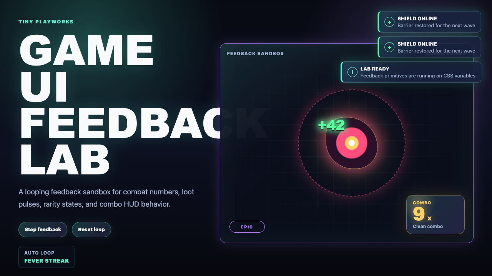

# Tiny Playworks Game UI Lab

[](https://github.com/tiny-playworks/game-ui-lab/actions/workflows/ci.yml)

Modern Game UI primitives for web games, AI interactive content, and HUD-heavy indie experiences.

This is not another React business UI library. The project focuses on motion-first feedback primitives: combat numbers, loot pulses, combo states, rarity frames, and lightweight HUD feedback.



## What This Project Is

- A React + TypeScript primitive kit for game-like web UI.
- A Panda CSS driven UI layer built on design tokens, recipes, and static CSS output.
- A Docs-native lab page for testing combined feedback behavior in motion.
- A foundation for future Pixi.js overlay experiments.

## What This Project Is Not

- Not an enterprise admin component library.
- Not a replacement for Ant Design, shadcn/ui, or Radix.
- Not a Table/Form/Modal business component set.
- Not a game engine.
- Not a Figma plugin project in Phase 1.

## Current Primitives

- `AbilityBar`: grouped ability slots for ready, cooling, locked, and cost states.
- `AbilityTooltip`: compact ability detail card for cost, cooldown, and state.
- `CastBar`: cast or channel progress bar.
- `TargetFrame`: target card with name, faction, health, shield, and statuses.
- `MiniMap`: lightweight marker map using 0-100 coordinates.
- `MapMarker`: map point for ally, enemy, objective, and neutral markers.
- `CompassBar`: compact heading strip with directional markers.
- `LocationTag`: location label with zone, danger, and status.
- `DialogueBox`: narrative dialogue panel with speaker, text, and portrait slot.
- `ChoicePrompt`: choice list with optional callbacks.
- `QuestLog`: quest list surface built from tracker primitives.
- `NotificationStack`: capped notification stack built from toast primitives.
- `DamageNumber`: floating combat text for damage, heal, critical, and miss states.
- `FloatingToast`: short-lived game feedback messages for info, success, warning, and loot events.
- `ComboCounter`: compact HUD counter for combo chains.
- `HealthBar`: persistent HP and shield readout for player, boss, and encounter HUD states.
- `ResourceMeter`: compact mana, energy, and stamina meter for ability costs and movement state.
- `CooldownSlot`: ability slot with cooldown mask, ready state, disabled state, and compact label.
- `StatusBadge`: small persistent status marker for buffs, debuffs, warnings, stacks, and durations.
- `LootCard`: compact loot item surface for rarity, quantity, value, and item metadata.
- `LootStack`: capped post-wave drop list with overflow handling.
- `RewardReveal`: sealed, revealed, and claimed reward panel for loot flow moments.
- `RarityBorder`: token-driven rarity frame for common, rare, epic, and legendary states.
- `GameUiProvider`: theme root for Game UI primitives.

## Public API

Use the main package entry for components and props types:

```tsx
import {
  AbilityBar,
  AbilityTooltip,
  CastBar,
  ChoicePrompt,
  ComboCounter,
  CompassBar,
  CooldownSlot,
  DamageNumber,
  DialogueBox,
  FloatingToast,
  GameUiProvider,
  HealthBar,
  LocationTag,
  LootCard,
  LootStack,
  MapMarker,
  MiniMap,
  NotificationStack,
  RarityBorder,
  ResourceMeter,
  RewardReveal,
  StatusBadge,
  TargetFrame,
  type AbilityBarProps,
  type AbilityTooltipProps,
  type CastBarProps,
  type ChoicePromptProps,
  type ComboCounterProps,
  type CompassBarProps,
  type CooldownSlotProps,
  type DamageNumberProps,
  type DialogueBoxProps,
  type FloatingToastProps,
  type HealthBarProps,
  type LocationTagProps,
  type LootCardProps,
  type LootStackProps,
  type MapMarkerProps,
  type MiniMapProps,
  type NotificationStackProps,
  type RarityBorderProps,
  type ResourceMeterProps,
  type RewardRevealProps,
  type StatusBadgeProps,
  type TargetFrameProps,
} from '@tiny-playworks/game-ui';

import '@tiny-playworks/game-ui/styles.css';
```

Do not import from internal package paths such as `packages/primitives/src/*`.
The `@tiny-playworks/game-ui` JavaScript entry does not inject styles. Always import `@tiny-playworks/game-ui/styles.css` once in the app entry.

## Commands

Use Node 24 and pnpm 11:

```bash
source ~/.nvm/nvm.sh
nvm use 24.15.0
pnpm install
```

Run the local docs and built-in lab:

```bash
pnpm dev
```

Public site routes:

- `/` - Rspress docs home
- `/guide/getting-started` - installation and usage
- `/primitives` - Primitive overview
- `/tokens` - Token overview
- `/lab` - Docs-native feedback lab

Build all packages and docs:

```bash
pnpm build
```

Build the GitHub Pages bundle:

```bash
pnpm build:pages
```

Run tests:

```bash
pnpm test
```

Run type checks:

```bash
pnpm typecheck
```

## Release

Prepare a release bundle locally:

```bash
pnpm release 0.2.1
```

This updates both package versions, runs `test` / `typecheck` / `build`, and writes publishable tarballs to `.release/v0.2.1/`.

Manual publish remains available:

```bash
cd packages/tokens
npm publish --access public

cd ../primitives
npm publish --access public
```

If GitHub Actions has a valid `NPM_TOKEN` secret, pushing a tag such as `v0.2.1` can publish automatically. The workflow checks that both package versions already equal the tag version before publishing.

If your npm account enforces 2FA for publish, the token itself must be a granular token with write permission and `Bypass 2FA` enabled. If that option is not enabled, the workflow will fail during `npm publish`.

## Phase 2 Scope

Phase 2 makes the project publicly consumable:

- pnpm monorepo
- `packages/tokens`
- `packages/primitives`
- `apps/docs`
- Panda preset based token foundation
- Rspress docs as the public Pages entry
- built-in Docs lab under `/lab`
- public API boundary from `@tiny-playworks/game-ui`
- npm-ready `@tiny-playworks/tokens` and `@tiny-playworks/game-ui`
- basic render and token tests

Deferred:

- Pixi.js overlay package
- Figma plugin or sync automation
- business components

## Token foundation

Current tokens are a single-source design token system exported from `@tiny-playworks/tokens`.

- The package exports token metadata, theme names, scoped token override helpers, and a Panda preset.
- The generated CSS still exposes stable `--game-ui-*` variables for direct consumption and local overrides.
- This is not a full Figma sync pipeline in the current phase.
- Rspress carries the docs, token overview, primitive pages, and live Lab in one runtime.

## Public site structure

The static site target is the GitHub Pages project URL:

- `https://tiny-playworks.github.io/game-ui-lab/`

Recommended structure:

- `/` - Docs entry / installation path
- `/tokens` - Token foundation overview
- `/primitives` - Primitive overview
- `/lab` - Docs-native feedback lab

The Pages build keeps clean URLs through a `404.html` fallback and uses `/game-ui-lab/` as the production base path.

## License

MIT
